# Development of Azure Function workshop

## Daniel Alejandro Castro Escobar - A00398005

### **1. Obtaining the source code**

Initially, the GitHub repository containing the Terraform configuration files is cloned. This allows obtaining locally the infrastructure definitions required for deployment. The command used is:

```bash
git clone https://github.com/ChristianFlor/azfunction-tf.git
````

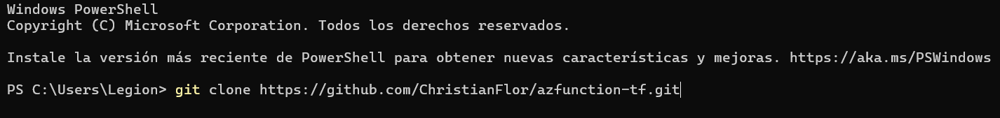

### **2. Accessing the working directory**

Once the repository is cloned, the directory that contains the main Terraform file and the complementary files is accessed, so that Terraform commands are executed in the correct context.

```bash
cd D:\Documentos\Universidad\Semestre 8\Plataformas II\VM Terraform>
```

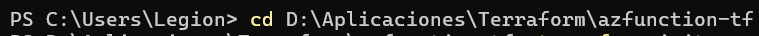

### **3. Terraform initialization**

The `terraform init` command is executed in order to prepare the working environment. This command downloads the necessary providers and configures the backend for Terraform state.

```bash
terraform init
```

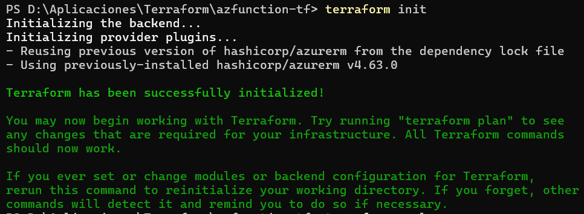

### **4. Initial deployment**

Next, `terraform apply` is executed to create the defined resources. During execution, Terraform requests confirmation by showing the change plan. It is necessary to respond affirmatively (`yes`). However, the deployment fails due to an error related to the Azure subscription and the default geographic region.

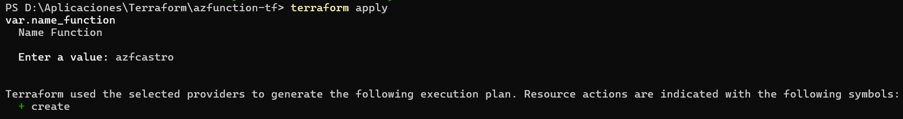
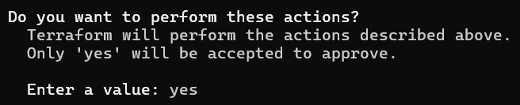
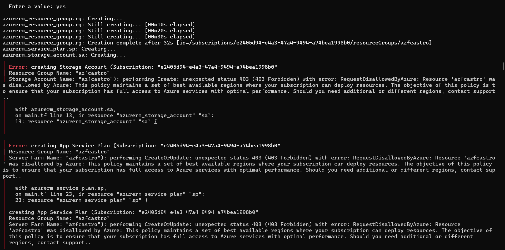

In this case, the error occurs because the region configured by default in the variable files is not enabled for the student subscription being used.

```bash
terraform apply
```

### **5. Region correction**

To solve the error, the `location` variable in the `variables.tf` file is modified, setting the East US 2 region (`eastus2`), which is compatible with the student subscription and has the required service availability.

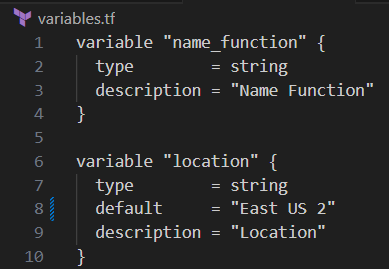

After this adjustment, the command is executed again:

```bash
terraform apply
```

Now it successfully completes the infrastructure creation.

### **6. Obtaining the deployed service URL**

At the end of the deployment, Terraform displays in the output the values defined in `outputs.tf`. Among them is the public URL of the created resource, which allows access to the running service.

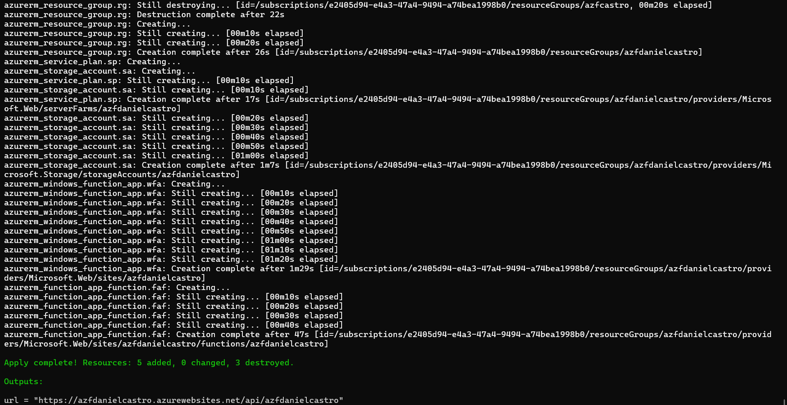

### **7. Verifying application functionality**

When accessing the URL through a browser, a message is displayed indicating that the HTTP function executed successfully:

> "This HTTP function was executed successfully. Pass a name in the query string or in the request body to get a personalized response."

This confirms that the Function App resource is operating and responding to HTTP requests.

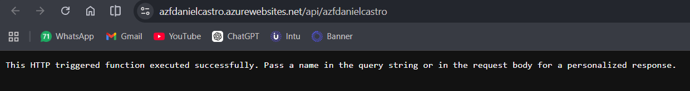

### **8. Inspection in Azure Portal**

The Azure portal is accessed and the created resource group is located, whose name was defined in the configuration.

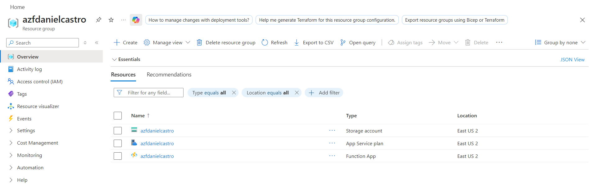

Within this group, all the resources automatically generated by Terraform can be observed:

* Storage Account
* App Service Plan
* Function App

This demonstrates that the deployed infrastructure matches what was defined in the code.

### **9. Access to the Function App domain**

From the Function App page in the portal, its default domain is accessed, confirming again that the application is publicly available and responds as expected.

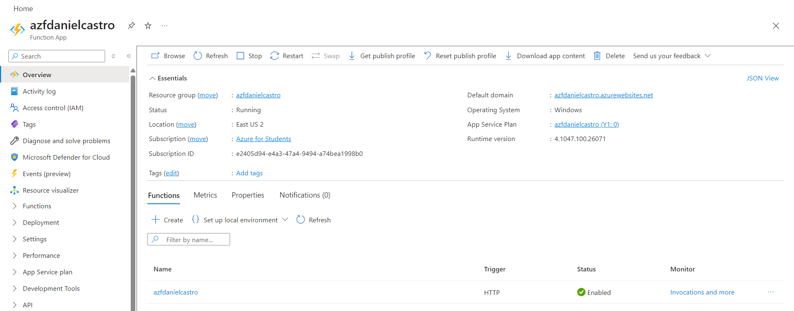
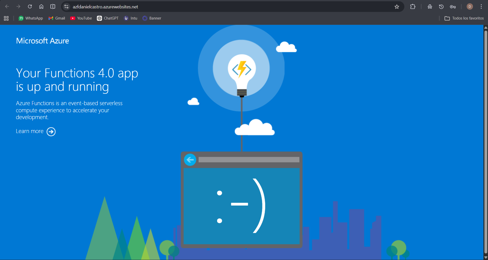
